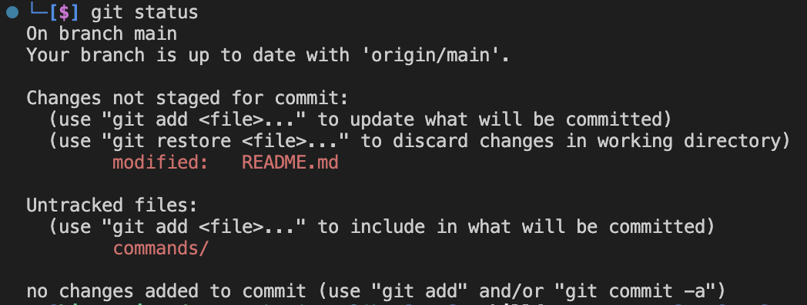
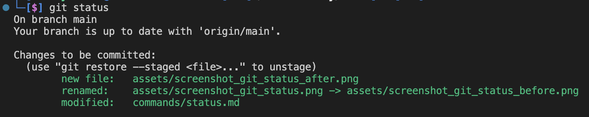
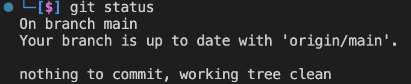

[< на главную](../README.md)

**git status** - проверка статуса состояния текущего локального репозитория. 

Вывод команды до выполнения команд по добавлению, сохранению и заливанию изменений в проекте на удаленный репозиторий:

Вывод команды после добавления изменения при помощи команды git add:

Вывод команды после залития изменений на удаленный репозиторий:

> Вывод на примерах имеет разные файлы, т.к. выполнение команд происходило в разное время. У вас, когда вы будете проводить данную команду и отслеживать статус, то будет вывод с теми файлами, с которыми вы работали.
