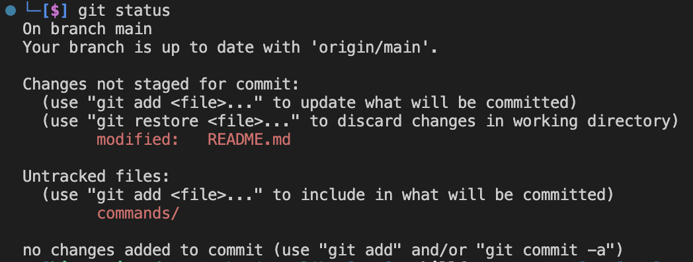

[< на главную](../README.md)

**git status** - проверка статуса состояния текущего локального репозитория. 

Пример вывода команды до выполнения команд по добавлению, сохранению и заливанию изменений в проекте на удаленный репозиторий:

